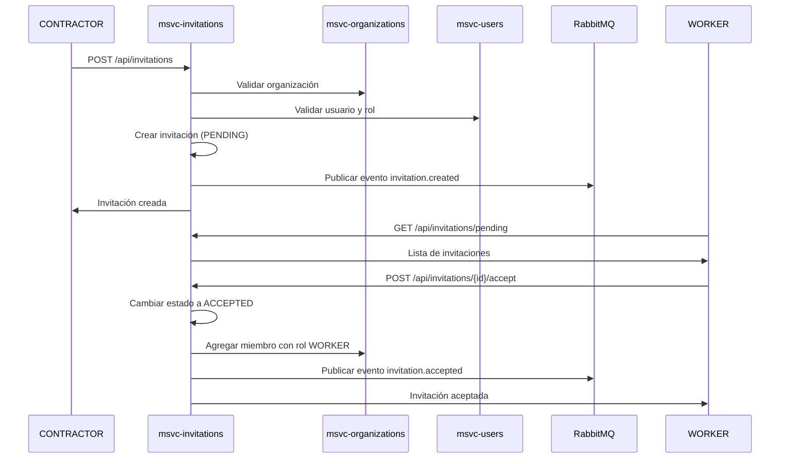

# Microservicio de Invitaciones (msvc-invitations)

## Descripción

Microservicio encargado de gestionar las invitaciones a organizaciones en la plataforma ClearCost. Permite que los creadores de organizaciones (CONTRACTORs) inviten a usuarios con rol WORKER para que se unan a sus organizaciones.

## Características Principales

### 1. Gestión de Invitaciones

- **Crear Invitaciones**: Solo el creador de una organización (CONTRACTOR) puede enviar invitaciones
- **Validación de Roles**: Solo se pueden invitar usuarios con rol `ROLE_WORKER`
- **Prevención de Duplicados**: No se pueden enviar invitaciones duplicadas a un mismo usuario si ya tiene una pendiente
- **Estados de Invitación**:
  - `PENDING`: Invitación enviada y esperando respuesta
  - `ACCEPTED`: Invitación aceptada por el usuario
  - `REJECTED`: Invitación rechazada por el usuario
  - `EXPIRED`: Invitación expirada (7 días)

### 2. Aceptar/Rechazar Invitaciones

- Los usuarios invitados pueden:
  - Aceptar invitaciones (automáticamente se añaden a la organización con rol `WORKER`)
  - Rechazar invitaciones
  - Ver todas sus invitaciones pendientes

### 3. Integración con RabbitMQ

El microservicio publica eventos para:
- `invitation.created`: Cuando se crea una nueva invitación
- `invitation.accepted`: Cuando un usuario acepta una invitación
- `invitation.rejected`: Cuando un usuario rechaza una invitación

## Arquitectura

### Tecnologías Utilizadas

- **Spring Boot 3.4.1**: Framework principal
- **Spring Data JPA**: Persistencia de datos
- **MySQL**: Base de datos
- **RabbitMQ**: Mensajería asíncrona
- **Spring Cloud OpenFeign**: Comunicación con otros microservicios
- **Spring Security + JWT**: Autenticación y autorización
- **Spring Cloud Eureka**: Descubrimiento de servicios (opcional)

### Comunicación con Otros Microservicios

- **msvc-users**: Validación de usuarios y roles
- **msvc-organizations**: Agregar miembros cuando se aceptan invitaciones

## Endpoints

### Autenticación
Todos los endpoints requieren un token JWT en el header `Authorization: Bearer <token>`

### API REST

#### POST /api/invitations
Crear una nueva invitación (solo CONTRACTOR creador de la organización)

**Request Body:**
```json
{
  "organizationId": 1,
  "inviteeUserId": 5,
  "inviteeEmail": "usuario@example.com"
}
```

**Response:**
```json
{
  "id": 1,
  "organizationId": 1,
  "organizationName": "Constructora ABC",
  "inviterId": 2,
  "inviterName": "Juan Pérez",
  "inviteeUserId": 5,
  "inviteeEmail": "usuario@example.com",
  "status": "PENDING",
  "createdAt": "2025-11-04T10:30:00",
  "expiresAt": "2025-11-11T10:30:00"
}
```

#### POST /api/invitations/{id}/accept
Aceptar una invitación

**Response:**
```json
{
  "id": 1,
  "organizationId": 1,
  "organizationName": "Constructora ABC",
  "status": "ACCEPTED",
  ...
}
```

#### POST /api/invitations/{id}/reject
Rechazar una invitación

#### GET /api/invitations/my-invitations
Obtener todas las invitaciones del usuario autenticado

#### GET /api/invitations/pending
Obtener solo las invitaciones pendientes del usuario autenticado

## Configuración

### Variables de Entorno

```properties
# Base de Datos
spring.datasource.url=jdbc:mysql://localhost:3306/clearcost_invitations_db
spring.datasource.username=root
spring.datasource.password=root

# RabbitMQ
spring.rabbitmq.host=localhost
spring.rabbitmq.port=5672
spring.rabbitmq.username=guest
spring.rabbitmq.password=guest

# JWT
jwt.secret-key=<tu-clave-secreta>
jwt.expiration=86400000

# URLs de otros microservicios
msvc.users.url=http://localhost:8001
msvc.organizations.url=http://localhost:8002

# Puerto
server.port=8004
```

## Modelo de Datos

### Entidad: Invitation

```java
{
  "id": Long,
  "organizationId": Long,
  "inviterId": Long,
  "inviteeUserId": Long,
  "inviteeEmail": String,
  "status": InvitationStatus,
  "createdAt": LocalDateTime,
  "expiresAt": LocalDateTime
}
```

## Reglas de Negocio

1. **Solo CONTRACTORs pueden invitar**: El usuario que invita debe ser el creador de la organización
2. **Solo ROLE_WORKER pueden ser invitados**: No se pueden invitar usuarios con `ROLE_CLIENT` o `ROLE_PENDING_SELECTION`
3. **No invitaciones duplicadas**: Un usuario no puede tener más de una invitación pendiente de la misma organización
4. **Expiración automática**: Las invitaciones expiran después de 7 días
5. **Validación de usuarios**: Todos los usuarios (invitador e invitado) deben existir en msvc-users
6. **Validación de organizaciones**: La organización debe existir en msvc-organizations
7. **Auto-añadir al aceptar**: Cuando un usuario acepta, automáticamente se añade como miembro con rol `WORKER`

## Eventos RabbitMQ

### Exchange
- **Nombre**: `invitation.exchange`
- **Tipo**: Topic

### Colas y Routing Keys

| Cola | Routing Key | Descripción |
|------|-------------|-------------|
| invitation.created.queue | invitation.created | Nueva invitación creada |
| invitation.accepted.queue | invitation.accepted | Invitación aceptada |
| invitation.rejected.queue | invitation.rejected | Invitación rechazada |
| invitation.user.queue | - | Cola para escuchar eventos externos |

## Instalación y Ejecución

### Prerrequisitos

1. Java 21
2. Maven 3.8+
3. MySQL 8.0+
4. RabbitMQ 3.x

### Pasos

1. **Clonar el repositorio**
```bash
git clone <repository-url>
cd msvc-invitations
```

2. **Crear la base de datos**
```sql
CREATE DATABASE clearcost_invitations_db;
```

3. **Configurar application.properties**
Ajustar las credenciales de base de datos y RabbitMQ

4. **Compilar y ejecutar**
```bash
mvn clean install
mvn spring-boot:run
```

El microservicio estará disponible en `http://localhost:8004`

## Testing

Para probar el microservicio:

1. **Obtener un token JWT** desde msvc-users
2. **Crear una organización** (el usuario se convierte en CONTRACTOR)
3. **Enviar una invitación** a un usuario con ROLE_WORKER
4. **Aceptar/Rechazar** la invitación con el usuario invitado

## Flujo Completo de Invitación



## Seguridad

- **JWT Stateless**: No hay sesiones en servidor
- **Validación de roles**: Solo usuarios con roles específicos pueden realizar ciertas acciones
- **Validación de propiedad**: Solo el creador de una organización puede invitar
- **Validación de destinatario**: Solo el usuario invitado puede aceptar/rechazar su invitación

## Logs

El microservicio genera logs detallados de:
- Creación de invitaciones
- Aceptación/Rechazo de invitaciones
- Publicación de eventos RabbitMQ
- Errores de comunicación con otros microservicios

## Próximas Mejoras

- [ ] Notificaciones por email
- [ ] Límite de invitaciones pendientes por organización
- [ ] Dashboard de invitaciones para CONTRACTORs
- [ ] Invitaciones por código/link
- [ ] Historial de invitaciones
- [ ] Reintentos automáticos en caso de fallo
- [ ] Dead Letter Queue para mensajes fallidos

## Autor

GreatBuild Team - ClearCost Platform
